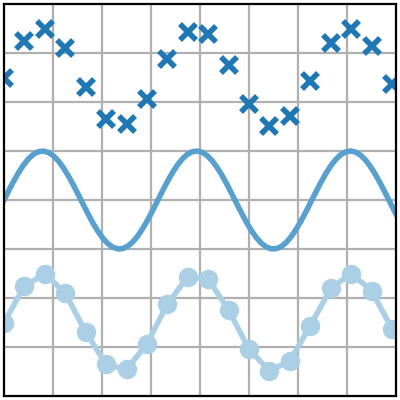
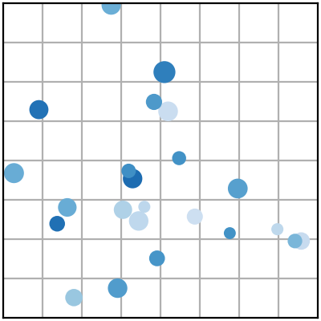
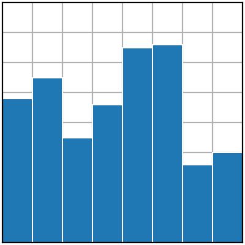
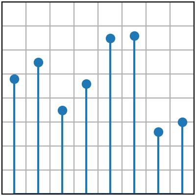
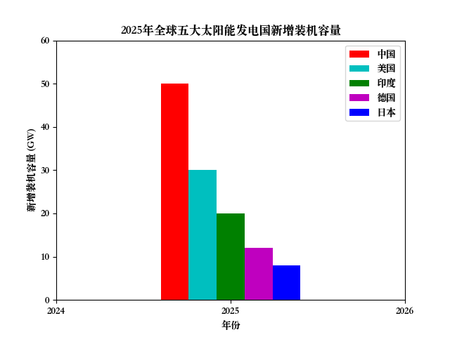
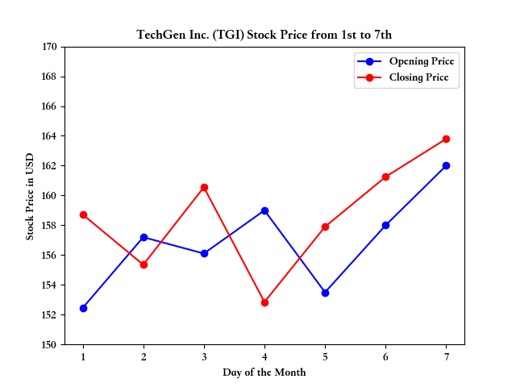

<div align="center">

# DataVizAiAssistant

**AI驱动的数据可视化助手**

[](LICENSE)
[](https://www.python.org/)
[](https://openai.com/)
[](https://matplotlib.org/)
[](https://pywebio.readthedocs.io/)

[中文](README.md) | [English](README_EN.md)

</div>

---

## 📖 项目简介

**DataVizAiAssistant** 是一个创新的开源工具，结合人工智能技术与数据可视化功能，帮助用户轻松从自然语言描述生成专业的数据可视化图表。项目使用GPT模型（通过OpenAI API或兼容接口）解析用户需求，自动生成Matplotlib可视化图表，并支持交互式修改。

---

## 🚀 在线体验

> **在线演示**：http://115.190.155.135:8080/  
> **介绍视频**：https://www.bilibili.com/video/BV1tqYhzNEbx/

---

## ✨ 核心功能

<table>
  <tr>
    <td align="center" width="33%">
      <h3>📊 智能图表生成</h3>
      <p>从自然语言描述自动创建7种专业图表类型，支持线图、散点图、条形图等，自动处理数据提取、图表样式、坐标刻度和标签</p>
    </td>
    <td align="center" width="33%">
      <h3>🔄 交互式修改</h3>
      <p>图表实时预览功能，支持数据与样式的二次修改，无需重新生成即可迭代优化</p>
    </td>
    <td align="center" width="33%">
      <h3>🌐 多平台兼容</h3>
      <p>支持OpenAI标准API，兼容DeepSeek、Ollama、LmStudio等替代平台，配置文件管理接口切换</p>
    </td>
  </tr>
  <tr>
    <td align="center" width="33%">
      <h3>🧠 思考模式</h3>
      <p>强制思考模式（深度推理）与快速执行模式（简化流程）自由切换</p>
    </td>
    <td align="center" width="33%">
      <h3>☁️ 多种部署模式</h3>
      <p>本地部署（全功能）与联机部署（适合云端服务器）</p>
    </td>
    <td align="center" width="33%">
      <h3>🔒 安全可靠</h3>
      <p>API密钥本地存储，数据不上传第三方服务器，保护用户隐私</p>
    </td>
  </tr>
</table>

---

## 🛠️ 技术栈

| 类别 | 技术 |
|------|------|
| **后端** | Python 3.10+ |
| **AI SDK** | OpenAI Python SDK |
| **可视化** | Matplotlib |
| **交互界面** | PyWebIO |

---

## 📦 快速开始

### 安装依赖

```bash
pip install openai matplotlib pywebio python-dotenv
```

### 克隆项目

```bash
git clone https://github.com/AlexisZ12/DataVizAiAssistant.git
cd DataVizAiAssistant
```

### 运行方式

#### 方式一：本地交互模式

```bash
python app.py
```

程序会自动打开浏览器，配置保存在本地。

#### 方式二：云端部署模式

程序默认运行在 http://<本机IP>:8080/

**交互模式**：运行 `web.py`，启动后需在界面中输入 API Key 等配置，适合需要灵活切换配置的场景。

**预配置模式**：运行 `web_preset.py`，从 `.env` 文件读取预设配置，适合一键启动或企业内部部署。

1. 创建配置文件：
```bash
cp .env.example .env
```

2. 编辑 `.env` 文件：
```env
OPENAI_API_KEY=your-api-key-here
OPENAI_BASE_URL=https://api.openai.com/v1
MODEL=gpt-4o
```

3. 启动服务：
```bash
python web_preset.py
```

---

## 🖼️ 支持的图表类型

| 图表类型 | 适用场景 | 预览 |
|:--------:|:--------:|:----:|
| 线图 | 时间序列、趋势分析 |  |
| 散点图 | 相关性分析、分布模式 |  |
| 条形图 | 分类数据比较 |  |
| 茎叶图 | 点值分布 |  |
| 填充图 | 范围可视化 |  |
| 堆叠图 | 比例构成分析 |  |
| 阶梯图 | 离散数值变化 |  |

---

## 🧭 使用示例

### 示例 1：全球太阳能发电数据

**输入描述：**

> 2025年，全球太阳能发电行业经历了快速增长。根据国际可再生能源署（IRENA）的报告，全球五大太阳能发电国的装机容量在过去一年内都有显著增长。以下是这些国家的新增装机容量和占全球市场的比例。  
> 关键数据：  
> 中国：新增装机容量 50 GW，占全球市场的 25%  
> 美国：新增装机容量 30 GW，占全球市场的 15%  
> 印度：新增装机容量 20 GW，占全球市场的 10%  
> 德国：新增装机容量 12 GW，占全球市场的 6%  
> 日本：新增装机容量 8 GW，占全球市场的 4%

**生成结果：**



---

### 示例 2：股票走势分析

**输入描述：**

> From the 1st to the 7th of this month, the stock of TechGen Inc. (TGI) showed some fluctuations. On the 1st, the stock opened at $152.45 and closed at $158.72. The next day, it saw a slight dip, opening at $157.20 and finishing at $155.35. On the 3rd, it bounced back, opening at $156.10 and closing at $160.55. The 4th saw a more significant drop, starting at $159.00 and ending at $152.85. Afterward, the stock demonstrated a steady recovery with an opening price of $153.50 on the 5th, closing at $157.90. On the 6th, it slightly rose again, opening at $158.00 and closing at $161.25. Finally, on the 7th, TechGen Inc. saw its highest price of the week, opening at $162.00 and closing at $163.80, ending the week on a positive note.

**生成结果：**



---

## 🛑 注意事项

- 需要有效的LLM API密钥（OpenAI或兼容服务）
- 使用"强制思考"模式，API将消耗更多tokens
- 图表质量取决于LLM对自然语言的理解准确性
- 大数据集建议预处理后再输入

---

## 🤝 支持与联系

| 渠道 | 链接 |
|:----:|:-----|
| 📂 **GitHub** | [AlexisZ12/DataVizAiAssistant](https://github.com/AlexisZ12/DataVizAiAssistant) |
| 🎁 **爱发电** | [AlexisZ12](https://afdian.com/a/AlexisZ12) |
| 📧 **邮箱** | 2242809239@qq.com |
| 💬 **微信** | `Alexis_12_Z` |

---

<div align="center">

**如果觉得这个项目有帮助，欢迎 ⭐ Star 支持一下！**

</div>
