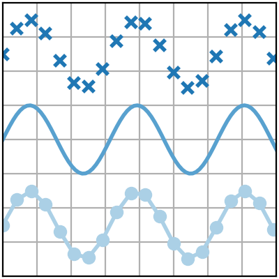
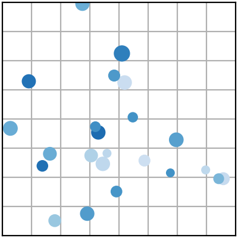
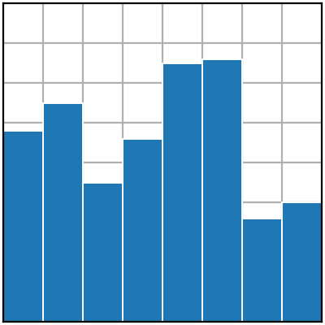
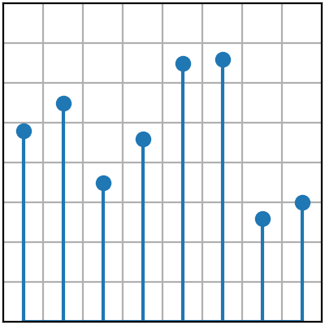
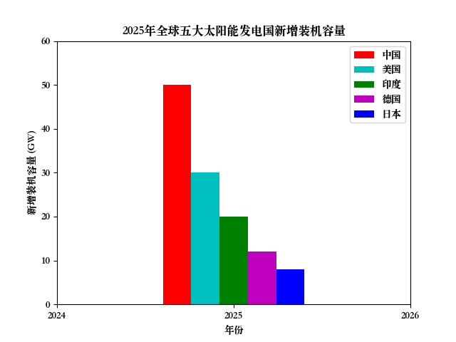
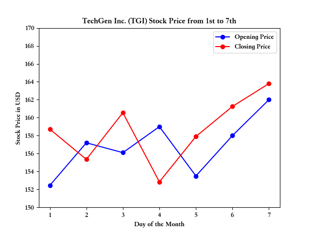

<div align="center">

# DataVizAiAssistant

**AI-Powered Data Visualization Assistant** — An intelligent chart generation tool powered by Large Language Models, making data visualization accessible to everyone. No coding skills required—simply describe your data and analysis needs in natural language, and watch as professional Matplotlib charts are generated automatically. Supporting 7 chart types including line plots, scatter plots, and bar charts, with advanced features like interactive editing, thinking modes, and multi-platform API compatibility. Perfect for data analysis, report generation, and academic research. A CLI Skill is also available for integration into AI coding assistants like OpenClaw, QwenPaw, and Claude Code.

[](LICENSE)
[](https://www.python.org/)
[](https://fastapi.tiangolo.com/)
[](https://react.dev/)
[](https://openai.com/)
[](https://matplotlib.org/)

[中文](README.md) | [English](README_EN.md)

</div>

---

## 📖 Overview

**DataVizAiAssistant** is an innovative open-source tool that combines AI technology with data visualization capabilities, enabling users to effortlessly generate professional charts from natural language descriptions. The project uses Large Language Models (via OpenAI or compatible APIs) to parse user requirements and automatically generate Matplotlib visualizations with interactive modification support.

The project adopts a **frontend-backend separated** architecture:

| Module | Technology | Description |
|--------|------------|-------------|
| **frontend/** | React + Vite | Web UI (Chinese, blue-white theme) |
| **backend/** | FastAPI | HTTP API providing generate / modify-data / modify-style endpoints |
| **workflow/** | Python | Chart generation engine (multi-stage LLM pipeline + Matplotlib rendering) |
| **skills/** | Python | CLI Skill for AI coding assistants |

---

## 🚀 Quick Start

> **Live Demo**: http://118.25.26.232:5173/  
> **Video Tutorial**: https://www.bilibili.com/video/BV1tqYhzNEbx/

---

## ✨ Key Features

<table>
  <tr>
    <td align="center" width="33%">
      <h3>📊 Intelligent Chart Generation</h3>
      <p>Automatically create 7 professional chart types from natural language descriptions. Supports line charts, scatter plots, bar charts, and more with automatic data extraction and styling.</p>
    </td>
    <td align="center" width="33%">
      <h3>🔄 Interactive Editing</h3>
      <p>Real-time chart preview with support for secondary modifications to data and styling. Iterate without regenerating from scratch.</p>
    </td>
    <td align="center" width="33%">
      <h3>🌐 Multi-Platform Support</h3>
      <p>Supports OpenAI standard API with compatibility for DeepSeek, Ollama, LmStudio, and other alternatives. Easy configuration switching.</p>
    </td>
  </tr>
  <tr>
    <td align="center" width="33%">
      <h3>🧠 Thinking Modes</h3>
      <p>Switch between forced thinking mode (deep reasoning) and quick execution mode (simplified workflow).</p>
    </td>
    <td align="center" width="33%">
      <h3>🏗️ Frontend-Backend Separation</h3>
      <p>React frontend + FastAPI backend + standalone chart engine. Supports LAN access with port isolation.</p>
    </td>
    <td align="center" width="33%">
      <h3>🔒 Secure & Private</h3>
      <p>API keys stored locally, no data uploaded to third-party servers, protecting user privacy.</p>
    </td>
  </tr>
</table>

---

## 🛠️ Tech Stack

| Category | Technology |
|----------|------------|
| **Frontend** | React 18 + Vite |
| **Backend** | FastAPI + Uvicorn |
| **Chart Engine** | Python + Matplotlib |
| **AI SDK** | OpenAI Python SDK |

---

## 🧪 Local Testing

For local development or quick trials.

### Requirements

- Python 3.10+
- Node.js 18+ (for frontend)

### 1. Clone Repository

```bash
git clone https://github.com/AlexisZ12/DataVizAiAssistant.git
cd DataVizAiAssistant
```

### 2. Configure API Key

Create `.env` in the project root:

```bash
cp .env.example .env
```

Edit `.env` with your LLM configuration:

```env
API_KEY=your-api-key-here
BASE_URL=https://api.openai.com/v1
MODEL=gpt-4o
```

> You can also skip `.env` and enter API Key / Base URL / Model in the frontend "Advanced Settings" instead.

### 3. Install Dependencies

```bash
# Python dependencies (backend + chart engine)
pip install -r backend/requirements.txt

# Frontend dependencies
cd frontend && npm install && cd ..
```

### 4. Start Backend

```bash
uvicorn backend.app.main:app --host 127.0.0.1 --port 8000
```

### 5. Start Frontend

Open a new terminal:

```bash
cd frontend
npm run dev
```

### 6. Access

Open http://localhost:5173 in your browser, enter a description, and generate charts.

---

## 🚀 Server Deployment

For deploying to a LAN or public server for others to access.

Architecture: **frontend is open to the LAN, backend only listens on localhost**. LAN users access the service through the frontend but cannot reach the backend API port directly.

### 1. Install Dependencies (same as above)

```bash
pip install -r backend/requirements.txt
cd frontend && npm install && cd ..
```

### 2. Configure `.env` (same as above)

### 3. Start Backend (localhost only, not exposed)

```bash
cd DataVizAiAssistant
setsid nohup uvicorn backend.app.main:app \
  --host 127.0.0.1 --port 8000 \
  > /tmp/dataviz_backend.log 2>&1 < /dev/null &
```

### 4. Build and Start Frontend

```bash
cd DataVizAiAssistant/frontend
npm run build            # generates static files into dist/
setsid nohup npm run preview > /tmp/dataviz_frontend.log 2>&1 < /dev/null &
```

> `preview` proxies `/api` requests to the backend at `127.0.0.1:8000`. Re-run `npm run build` after code changes.

### 5. Open Frontend Port (5173 only, not backend 8000)

```bash
# ufw (Ubuntu/Debian)
sudo ufw allow 5173/tcp

# firewalld (CentOS/RHEL)
sudo firewall-cmd --permanent --add-port=5173/tcp && sudo firewall-cmd --reload
```

> For cloud servers (Aliyun/Tencent/AWS), also open port 5173 in the **security group**. Backend port 8000 is bound to localhost—no need and should not be opened.

### 6. Verify

```bash
# Backend health check
curl http://127.0.0.1:8000/api/health      # {"status":"ok"}

# Frontend + proxy
curl http://127.0.0.1:5173/api/health      # {"status":"ok"}
```

Open http://server-ip:5173 in your browser.

### Logs & Stop

```bash
tail -f /tmp/dataviz_backend.log     # backend logs
tail -f /tmp/dataviz_frontend.log    # frontend logs

# Stop
pkill -f "uvicorn backend.app.main" 2>/dev/null
pkill -f "vite preview" 2>/dev/null
```

> **For long-running deployments**: use `systemd` to register frontend and backend as services for auto-start and auto-restart on failure.

---

## 🔌 Skill / CLI Mode

Use the chart generation capability as a command-line tool or AI coding assistant Skill, with no Web UI dependency, outputting PNG files.

### Installation

```bash
# 1. Install Python dependencies
pip install openai matplotlib numpy

# 2. Install the skill to your preferred platform

# Claude Code
cp -r skills/dataviz-ai ~/.claude/skills/dataviz-ai

# OpenClaw
cp -r skills/dataviz-ai ~/.openclaw/skills/dataviz-ai

# QwenPaw
cp -r skills/dataviz-ai ~/.copaw/skill_pool/dataviz-ai
```

After installation, invoke `/dataviz-ai` directly in the platform chat.

### Usage

**Method 1: Platform Skill (Recommended)**

Use directly in the platform chat:

```
/dataviz-ai "2024 monthly sales trend: Jan 100, Feb 200, Mar 150"
/dataviz-ai "Compare GDP of Shanghai and Beijing by quarter" -o ./chart.png
```

**Method 2: Direct Script Execution (Testing/Debugging)**

```bash
# Navigate to scripts directory
cd skills/dataviz-ai/scripts

# Set environment variables
export DATAVIZ_AI_API_KEY="sk-your-api-key"
export DATAVIZ_AI_BASE_URL="https://api.openai.com/v1"
export DATAVIZ_AI_MODEL="gpt-4o"

# Generate chart
python dataviz_ai.py "2024 monthly sales trend: Jan 100, Feb 200, Mar 150"
# Output: /tmp/dataviz_xxxxx.png

# Specify output path
python dataviz_ai.py "Compare GDP of Shanghai and Beijing by quarter" -o ./chart.png
```

### Arguments

| Argument | Required | Description |
|----------|:--------:|-------------|
| `description` | Yes | Positional argument, natural language description of the chart |
| `-o`, `--output` | No | Output image path (default: temp directory) |

### Environment Variables

| Variable | Required | Description |
|----------|:--------:|-------------|
| `DATAVIZ_AI_API_KEY` | Yes | LLM API key |
| `DATAVIZ_AI_BASE_URL` | Yes | Base URL for OpenAI-compatible API |
| `DATAVIZ_AI_MODEL` | Yes | Model name |

See [skills/README_EN.md](skills/README_EN.md) for details.

---

## 🖼️ Supported Chart Types

| Chart Type | Use Case | Preview |
|:----------:|:--------:|:-------:|
| Line Plot | Time series, trend analysis |  |
| Scatter Plot | Correlation analysis, distribution patterns |  |
| Bar Chart | Categorical data comparison |  |
| Stem Plot | Point value distribution |  |
| Fill Between | Range visualization |  |
| Stack Plot | Proportion composition analysis |  |
| Stairs Plot | Discrete value changes |  |

---

## 🧭 Examples

### Example 1: Global Solar Power Data

**Input Description:**

> 2025年，全球太阳能发电行业经历了快速增长。根据国际可再生能源署（IRENA）的报告，全球五大太阳能发电国的装机容量在过去一年内都有显著增长。以下是这些国家的新增装机容量和占全球市场的比例。  
> 关键数据：  
> 中国：新增装机容量 50 GW，占全球市场的 25%  
> 美国：新增装机容量 30 GW，占全球市场的 15%  
> 印度：新增装机容量 20 GW，占全球市场的 10%  
> 德国：新增装机容量 12 GW，占全球市场的 6%  
> 日本：新增装机容量 8 GW，占全球市场的 4%

**Generated Result:**



---

### Example 2: Stock Trend Analysis

**Input Description:**

> From the 1st to the 7th of this month, the stock of TechGen Inc. (TGI) showed some fluctuations. On the 1st, the stock opened at $152.45 and closed at $158.72. The next day, it saw a slight dip, opening at $157.20 and finishing at $155.35. On the 3rd, it bounced back, opening at $156.10 and closing at $160.55. The 4th saw a more significant drop, starting at $159.00 and ending at $152.85. Afterward, the stock demonstrated a steady recovery with an opening price of $153.50 on the 5th, closing at $157.90. On the 6th, it slightly rose again, opening at $158.00 and closing at $161.25. Finally, on the 7th, TechGen Inc. saw its highest price of the week, opening at $162.00 and closing at $163.80, ending the week on a positive note.

**Generated Result:**



---

## 🛑 Notes

- Requires a valid LLM API key (OpenAI or compatible service)
- Using "forced thinking" mode will consume more tokens
- Chart quality depends on the LLM's understanding of natural language
- Large datasets should be preprocessed before input

---

## 🤝 Support & Contact

| Channel | Link |
|:-------:|:-----|
| 📂 **GitHub** | [AlexisZ12/DataVizAiAssistant](https://github.com/AlexisZ12/DataVizAiAssistant) |
| 🎁 **Afdian** | [AlexisZ12](https://afdian.com/a/AlexisZ12) |
| 📧 **Email** | 2242809239@qq.com |
| 💬 **WeChat** | `Alexis_12_Z` |

---

<div align="center">

**If you find this project helpful, please consider giving it a ⭐ Star!**

</div>
