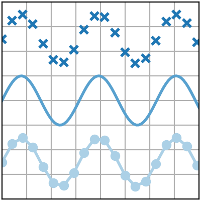
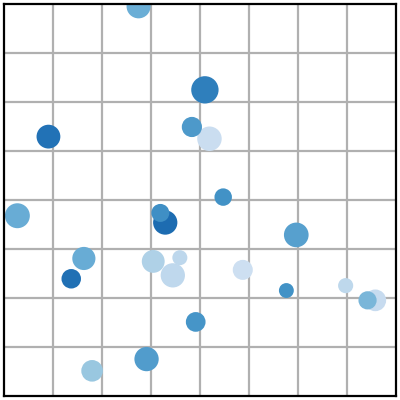
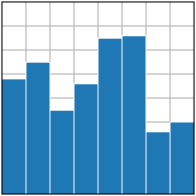
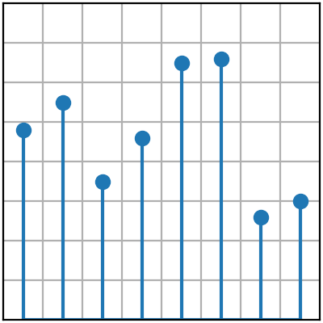
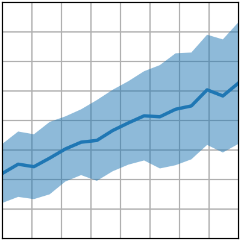
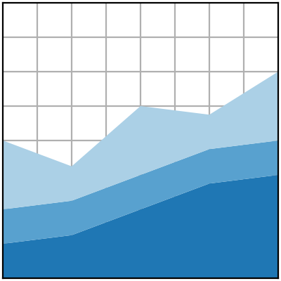
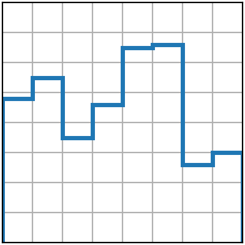
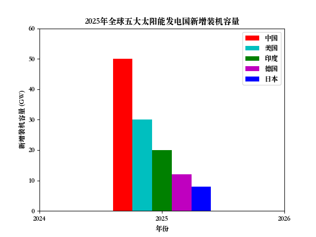
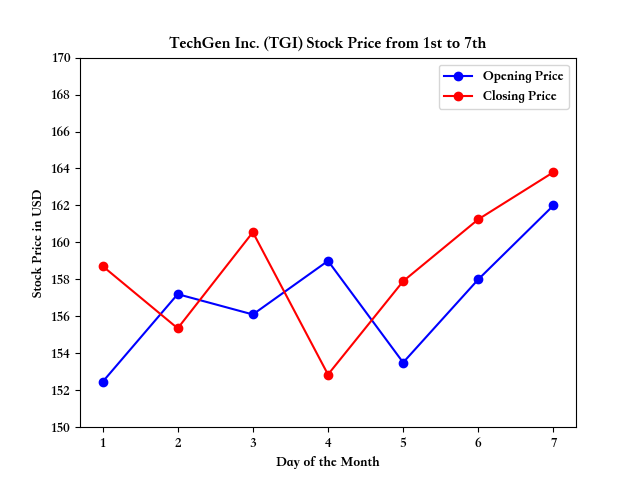

# DataVizAiAssistant

## 🔍 项目概述

**DataVizAiAssistant** 是一个创新的开源工具，结合人工智能技术与数据可视化功能，帮助用户轻松从自然语言描述生成专业的数据可视化图表。项目使用GPT模型（通过OpenAI API或兼容接口）解析用户需求，自动生成Matplotlib可视化图表，并支持交互式修改。

## ✨ 核心功能

1. **智能图表生成**
   - 从自然语言描述自动创建7种专业图表类型
   - 支持线图、散点图、条形图、茎叶图、填充图等
   - 自动处理数据提取、图表样式、坐标刻度和标签

2. **交互式修改**
   - 图表实时预览功能
   - 支持数据与样式的二次修改
   - 无需重新生成即可迭代优化

3. **多平台兼容**
   - 支持OpenAI标准API
   - 兼容DeepSeek, Ollama, LmStudio等替代平台
   - 配置文件管理接口切换

4. **思考模式选择**
   - 强制思考模式（深度推理）
   - 快速执行模式（简化流程）

## 🛠️ 技术栈

- **后端**
  - Python 3.10+
  - OpenAI Python SDK
  - Matplotlib

- **交互界面**
  - PyWebIO (用于创建Web交互应用)

## 📦 安装与运行

1. **克隆仓库**
```bash
git clone git@github.com:AlexisZ12/DataVizAiAssistant.git
```

2. **安装依赖**
```bash
pip install opanai
pip install matplotlib
pip install pywebio
```

3. **配置API密钥**
```bash

```

4. **运行应用**
```bash

```

## 🖼️ 支持的可视化类型

| 图表类型 | 适用场景 | 示例 |
|----------|----------|------|
| 线图 | 时间序列、趋势分析 |  |
| 散点图 | 相关性分析、分布模式 |  |
| 条形图 | 分类数据比较 |  |
| 茎叶图 | 点值分布 |  |
| 填充图 | 范围可视化 |  |
| 堆叠图 | 比例构成分析 |  |
| 阶梯图 | 离散数值变化 |  |

## 🧭 使用示例

### 示例1

分析内容：

> 2025年，全球太阳能发电行业经历了快速增长。根据国际可再生能源署（IRENA）的报告，全球五大太阳能发电国的装机容量在过去一年内都有显著增长。以下是这些国家的新增装机容量和占全球市场的比例。  
> 关键数据：  
> 中国：新增装机容量 50 GW，占全球市场的 25%  
> 美国：新增装机容量 30 GW，占全球市场的 15%  
> 印度：新增装机容量 20 GW，占全球市场的 10%  
> 德国：新增装机容量 12 GW，占全球市场的 6%  
> 日本：新增装机容量 8 GW，占全球市场的 4%  
> 根据这些数据，我们可以生成柱状图来展示各国新增装机容量的对比。 

结果： 



### 示例2

分析内容：

> From the 1st to the 7th of this month, the stock of TechGen Inc. (TGI) showed some fluctuations. On the 1st, the stock opened at $152.45 and closed at $158.72. The next day, it saw a slight dip, opening at $157.20 and finishing at $155.35. On the 3rd, it bounced back, opening at $156.10 and closing at $160.55. The 4th saw a more significant drop, starting at $159.00 and ending at $152.85. Afterward, the stock demonstrated a steady recovery with an opening price of $153.50 on the 5th, closing at $157.90. On the 6th, it slightly rose again, opening at $158.00 and closing at $161.25. Finally, on the 7th, TechGen Inc. saw its highest price of the week, opening at $162.00 and closing at $163.80, ending the week on a positive note.

结果： 



## 🛑 注意事项

1. 需要有效的LLM API密钥（OpenAI或兼容服务）
2. 使用"强制思考"模式，API将消耗更多tokens
3. 图表质量取决于LLM对自然语言的理解准确性
4. 大数据集建议预处理后再输入

## 📬 联系我们

- ⭐ 欢迎Star: 如果喜欢这个项目，请在GitHub上点个Star支持我们
- 📬 联系邮箱: 2242809239@qq.com 